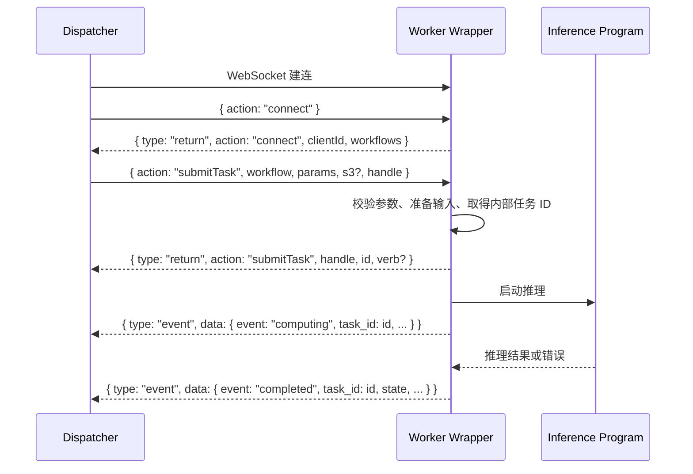

# Dispatcher ↔ Worker 通讯协议

本文只描述 Dispatcher 与 Worker 之间的 WebSocket 接口，用于给新的推理程序包装一层可接入 Dispatcher 的 Worker。

## 1. 最小实现要求

一个能接入当前 Dispatcher 的 Worker 只需要实现：

1. 接收 `connect`，返回支持的 workflow 列表。
2. 接收 `submitTask`，返回 Worker 内部任务 ID。
3. 推送可选的 `computing` 进度事件。
4. 推送且仅推送一次 `completed` 终态事件。

关键约束：

- 每个 WebSocket 文本消息包含一个完整 JSON 对象。
- `submitTask` 响应必须原样返回请求中的 `handle`。
- `submitTask` 成功响应必须早于该任务的任何事件。
- 事件中的 `task_id` 必须等于 `submitTask` 响应中的 `id`。
- 最终状态必须使用小写 `succeed` 或 `failed`。
- 不能用通用 `type: "error"` 代替任务失败终态。

## 2. 连接与传输

Worker 是 WebSocket 服务端，Dispatcher 是 WebSocket 客户端。Worker 需要监听一个 Dispatcher 可访问的 WebSocket URL，例如：

```text
ws://192.168.190.8:3000/
```

传输约定：

- 使用 UTF-8 JSON 文本消息。
- 当前没有应用层鉴权或协议版本协商。
- 当前没有应用层心跳消息。
- WebSocket ping/pong 可以按标准协议处理。
- 协议没有通用 `request_id`；任务提交通过 `handle` 关联。

## 3. 标准时序



## 4. 握手：`connect`

WebSocket 建立后，Dispatcher 发送：

```json
{
  "action": "connect"
}
```

Worker 应返回：

```json
{
  "type": "return",
  "action": "connect",
  "clientId": "b8a7d9e0-3c04-4c1e-9e10-xxxxxxxxxxxx",
  "workflows": [
    "flux_lora",
    "faceswap_xl_metadata"
  ]
}
```

字段说明：

| 字段 | 必需 | 类型 | 说明 |
| --- | --- | --- | --- |
| `type` | 是 | string | 固定为 `return`。 |
| `action` | 是 | string | 固定为 `connect`。 |
| `clientId` | 否 | string | Worker 的连接或后端标识。两个现有 Worker 都会返回，但 Dispatcher 当前不依赖其取值。 |
| `workflows` | 是 | string[] | Worker 支持的 workflow 名称。名称必须与任务中的 `workflow` 完全一致。 |

收到正确的握手响应前，Dispatcher 不会向该连接下发任务。

## 5. 提交任务：`submitTask`

### 5.1 请求

Worker 收到的消息格式：

```json
{
  "action": "submitTask",
  "workflow": "flux_lora",
  "params": {
    "label": "task-123",
    "prompt": "a portrait",
    "seed": 42,
    "lora_path": "lora.safetensors"
  },
  "s3": {
    "downloads": [
      {
        "key": "models/user-1/lora.safetensors",
        "local_file": "lora.safetensors",
        "url": "https://s3.example/presigned-download/..."
      }
    ],
    "relative_path_fields": ["lora_path"],
    "uploads": [
      "https://s3.example/presigned-upload/..."
    ]
  },
  "handle": "task-123"
}
```

顶层字段：

| 字段 | 必需 | 类型 | 说明 |
| --- | --- | --- | --- |
| `action` | 是 | string | 固定为 `submitTask`。 |
| `workflow` | 是 | string | 要执行的 workflow。 |
| `params` | 否，建议提供 | object | workflow 自定义参数；缺失时两个现有 Worker 按 `{}` 处理。 |
| `s3` | 否 | object | 输入文件下载和输出文件上传信息。 |
| `handle` | 是 | string | Dispatcher 生成的任务关联标识。Worker 不得修改。 |

`params` 的具体字段由 workflow 决定，不属于通用通讯协议。

### 5.2 成功接收响应

Worker 完成请求校验、输入准备并取得内部任务 ID 后，应返回：

```json
{
  "type": "return",
  "action": "submitTask",
  "handle": "task-123",
  "id": "worker-job-a92f",
  "verb": "/NewEngine/model-a/flux_lora"
}
```

| 字段 | 必需 | 类型 | 说明 |
| --- | --- | --- | --- |
| `type` | 是 | string | 固定为 `return`。 |
| `action` | 是 | string | 固定为 `submitTask`。 |
| `handle` | 是 | string | 必须与请求中的 `handle` 完全相同。 |
| `id` | 是 | string/number | Worker 内部任务 ID。建议使用非空且不复用的字符串。 |
| `verb` | 否 | string | 实例化后的任务描述；不影响任务状态。 |

`handle` 与 `id` 用途不同：

```text
submitTask 请求/响应关联：handle
后续 Worker 事件关联：   id → data.task_id
```

### 5.3 接收任务前失败

如果参数无效、输入文件下载失败或推理后端拒绝入队，Worker 应返回带原 `handle` 的失败提交响应：

```json
{
  "type": "return",
  "action": "submitTask",
  "handle": "task-123",
  "id": "rejected-a92f",
  "state": "failed",
  "cause": "Failed to download input: HTTP 403"
}
```

`id` 可以是为这次拒绝生成的临时唯一 ID。收到 `state: "failed"` 后，Dispatcher 会结束该任务。

此处不能只返回：

```json
{
  "type": "error",
  "message": "Task submission failed"
}
```

当前 Dispatcher 对通用错误只记日志，不会把它视为任务终态。结果是任务连接会一直等待，Worker 也无法继续接收后续任务。

### 5.4 消息顺序

任务提交响应必须先于该任务的事件：

```text
正确：submitTask return(id=X) → event(task_id=X)
错误：event(task_id=X) → submitTask return(id=X)
```

Dispatcher 收到提交响应后才知道 Worker 内部任务 ID。更早到达的事件会因 `task_id` 未知而被丢弃。

两个现有 Worker 的底层对象可能在 `submit()` 返回前同步产生 `queued` 或 `compute_started`。这些早到的非终态事件目前会被丢弃，通常不影响结果，但新 Worker 不应仿照。尤其不能让 `completed` 早于提交响应，否则唯一的终态事件会丢失。

如果推理 SDK 可能同步回调，包装层应先缓存事件，发送提交响应后再依次转发。

## 6. Worker 事件

### 6.1 通用格式

```json
{
  "type": "event",
  "data": {
    "event": "computing",
    "timestamp": 1787000000000,
    "task_id": "worker-job-a92f",
    "state": "running"
  }
}
```

| 字段 | 必需 | 类型 | 说明 |
| --- | --- | --- | --- |
| `type` | 是 | string | 固定为 `event`。 |
| `data.event` | 是 | string | 事件名称。 |
| `data.task_id` | 是 | string/number | 必须等于 `submitTask` 响应中的 `id`。 |
| `data.timestamp` | 否，建议提供 | number | Unix 毫秒时间戳。 |
| `data.state` | `completed` 时必需 | string | 当前任务状态。 |

事件应只发送到提交该任务的 WebSocket 连接。两个现有 Worker 会为兼容其前端而广播事件，但广播不是协议要求。

### 6.2 进度事件：`computing`

```json
{
  "type": "event",
  "data": {
    "event": "computing",
    "timestamp": 1787000001234,
    "task_id": "worker-job-a92f",
    "state": "running",
    "step": "denoise",
    "progress": 0.42,
    "expected_finish_time": 1787000040000
  }
}
```

| 字段 | 必需 | 类型 | 说明 |
| --- | --- | --- | --- |
| `step` | 否 | string | 当前步骤的可读名称。 |
| `progress` | 否 | number | 推荐使用 `[0, 1]` 范围内的完成比例。 |
| `expected_finish_time` | 否 | number | 预计完成时刻，使用 Unix 毫秒时间戳。 |

Worker 也可以发送 `queued`、`compute_started`、`compute_ended` 事件，但它们不是接入 Dispatcher 的必要条件。

### 6.3 完成事件：`completed`

成功示例：

```json
{
  "type": "event",
  "data": {
    "event": "completed",
    "timestamp": 1787000040123,
    "task_id": "worker-job-a92f",
    "state": "succeed",
    "outputs": {
      "save": ["./output/task-123.png"],
      "info": ["final prompt"]
    },
    "timestamps": {
      "queued": 1787000000000,
      "compute_start": 1787000001000,
      "compute_end": 1787000040000,
      "completed": 1787000040123
    },
    "additional_info": {}
  }
}
```

失败示例：

```json
{
  "type": "event",
  "data": {
    "event": "completed",
    "timestamp": 1787000040123,
    "task_id": "worker-job-a92f",
    "state": "failed",
    "outputs": null,
    "cause": "CUDA out of memory",
    "timestamps": {
      "queued": 1787000000000,
      "compute_start": 1787000001000,
      "completed": 1787000040123
    },
    "additional_info": {}
  }
}
```

| 字段 | 必需 | 类型 | 说明 |
| --- | --- | --- | --- |
| `event` | 是 | string | 固定为 `completed`。 |
| `task_id` | 是 | string/number | 当前 Worker 内部任务 ID。 |
| `state` | 是 | string | 只能是 `succeed` 或 `failed`。 |
| `outputs` | 成功时建议 | 任意 JSON 值 | 任务结果，Dispatcher 不解析其结构。 |
| `cause` | 失败时建议 | string 或 JSON 值 | 失败原因；推荐使用可读字符串。 |
| `timestamps` | 否 | object | Worker 内部阶段时间戳。 |
| `additional_info` | 否 | object | 额外诊断信息。 |

每个成功接收的任务必须最终产生且只产生一次 `completed`。发送完成事件后，不应再发送该任务的进度或第二个完成事件。

## 7. S3 文件交换

### 7.1 Worker 收到的结构

```json
{
  "s3": {
    "downloads": [
      {
        "key": "inputs/image.png",
        "local_file": "image.png",
        "url": "https://s3.example/presigned-get/..."
      }
    ],
    "relative_path_fields": ["input_image"],
    "uploads": [
      "https://s3.example/presigned-put/..."
    ]
  }
}
```

| 字段 | 说明 |
| --- | --- |
| `downloads[].url` | 输入文件的预签名 GET URL。 |
| `downloads[].local_file` | 下载后使用的任务内相对路径。 |
| `downloads[].key` | 对象存储 key，仅供识别；下载应使用 `url`。 |
| `relative_path_fields[]` | `params` 中需要转换成本地绝对路径的顶层字段名。 |
| `uploads[]` | 输出文件的预签名 PUT URL。 |

### 7.2 Worker 处理要求

推荐处理顺序：

1. 为任务创建独立临时目录。
2. 使用 `downloads[].url` 下载文件到对应 `local_file`。
3. 处理 `relative_path_fields` 指定的 `params` 字段：
   - 字符串转换为任务临时目录内的绝对路径；
   - 字符串数组逐项转换。
4. 输入准备成功后再确认接收任务。
5. 推理成功后，按 workflow 约定的顺序把输出文件 PUT 到 `uploads[]`。
6. 所有要求的输出上传成功后，才能发送 `completed/succeed`。
7. 下载、推理或上传任一阶段失败，都必须按所处阶段返回失败提交响应或 `completed/failed`。

输入文件和上传 URL 的数量、顺序由具体 workflow 约定。多输出任务必须明确本地输出列表与 `uploads[]` 的一一对应关系。

安全要求：

- 拒绝绝对形式的 `local_file`。
- 拒绝解析后逃出任务临时目录的 `..` 路径。
- 不应在持久日志中记录完整预签名 URL。
- 不同任务应使用隔离目录，避免文件污染或缓存误命中。

## 8. 错误与连接异常

### 8.1 通用错误

无效 JSON、未知 action 等非任务错误可以返回：

```json
{
  "type": "error",
  "message": "Unsupported action"
}
```

任务已经下发后，不能用该消息结束任务。必须使用：

- 接收确认前：`submitTask` 的 `return`，并带 `state: "failed"`；
- 接收确认后：`completed` 事件，并带 `state: "failed"`。

### 8.2 断线和超时

- WebSocket 在任务执行期间断开时，Dispatcher 会将该任务视为失败。
- 当前 Dispatcher 不发送应用层心跳。
- 当前 Dispatcher 不会主动取消超时任务。
- Worker 若保持连接但不发送终态，会导致该连接一直无法接收下一任务。

Worker 自身应设置输入下载、推理执行和输出上传超时，并监听推理子进程退出。所有异常路径都应收敛为一次失败终态。

当前 Dispatcher 在同一 Worker 连接上一次只下发一个任务。若 Worker 还允许其他客户端提交任务，应自行进行并发隔离或排队。

## 9. 推荐包装层结构

建议把 WebSocket 协议层与推理适配器分开：

```ts
interface InferenceAdapter {
  workflows(): Promise<string[]>;

  start(
    input: {
      workflow: string;
      params: Record<string, unknown>;
      workDir: string;
    },
    onProgress: (progress: {
      step?: string;
      progress?: number;
      expected_finish_time?: number;
    }) => void,
  ): Promise<{
    id: string;
    verb?: string;
    completion: Promise<{
      state: "succeed" | "failed";
      outputs?: unknown;
      outputFiles?: string[];
      cause?: unknown;
      additional_info?: Record<string, unknown>;
    }>;
  }>;
}
```

包装层负责：

- WebSocket 和 JSON 编解码；
- 回显 `handle`；
- 将内部 `id` 写入所有事件的 `task_id`；
- S3 下载、路径校验和输出上传；
- 保证提交响应先于任务事件；
- 推理异常、超时和子进程退出的统一处理；
- 完成事件去重。

推理适配器负责：

- workflow 参数转换；
- 启动具体推理程序；
- 提供内部任务 ID；
- 解析进度和结果。

## 10. 推荐处理流程

```text
收到 connect
  └─ 返回 return/connect + workflows

收到 submitTask
  ├─ 校验 action、workflow、handle、params
  ├─ 创建任务隔离目录
  ├─ 下载 S3 输入并转换路径字段
  │    └─ 失败：返回 return/submitTask + handle + state=failed
  ├─ 调用推理适配器，取得内部 id
  │    └─ 失败：返回 return/submitTask + handle + state=failed
  ├─ 返回 return/submitTask + handle + id
  ├─ 开始转发 computing 事件
  └─ 等待推理结束
       ├─ 成功：上传全部 S3 输出
       │    ├─ 上传成功：发送一次 completed/succeed
       │    └─ 上传失败：发送一次 completed/failed
       └─ 推理失败：发送一次 completed/failed
```

如果底层推理程序在返回内部 ID 前就可能报告进度，包装层应缓存这些进度，直到 `submitTask` 响应已经发送。

## 11. 接入验收清单

1. `connect` 能返回正确的 workflow 列表。
2. `submitTask` 响应原样回显 `handle`。
3. 每次成功接收都返回唯一的内部 `id`。
4. 所有事件的 `task_id` 都等于该 `id`。
5. 任何任务事件都不早于 `submitTask` 响应。
6. `computing.progress` 使用 `[0, 1]` 范围。
7. 成功任务最终发送一次 `completed/succeed`。
8. 已接收任务失败时最终发送一次 `completed/failed`。
9. 输入准备或入队失败时返回 `submitTask state: failed`，不只返回通用错误。
10. S3 输入写入隔离目录，且路径穿越会被拒绝。
11. 所有要求的 S3 输出上传成功后才报告成功。
12. 推理超时、子进程退出和连接异常都有明确处理。
13. 包装层不会重复发送 `completed`。

## 12. 当前协议限制

- 没有协议版本字段。
- 没有应用层鉴权和心跳。
- 没有任务取消、暂停、重试或恢复消息。
- 没有 Worker 并发容量声明。
- 一个 Dispatcher 到 Worker 的连接固定单任务执行。
- 通用 `type: "error"` 不会结束已下发任务。
- `outputs` 没有统一 schema，由具体 workflow 约定。

在不修改 Dispatcher 的情况下，新 Worker 应严格遵守本文的 ID 关联、消息顺序和失败终态规则。
